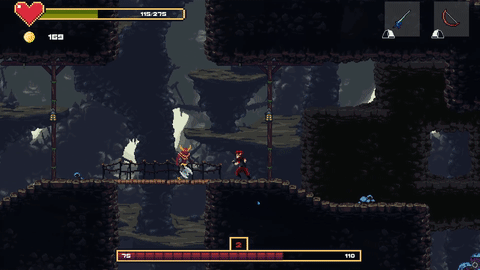

# Devil's Prodigy

**Devil's Prodigy** is a 2D platformer rogue-lite game created in Unity. It features a variety of gameplay elements, including different types of enemies, weapons, levels, bosses, and skills. 

---

## Features

- **Procedural Generation**: Levels and enemy placements are randomly generated, making each run unique.
- **Enemies**: Multiple enemy types, including melee and ranged attackers.
- **Levels**: Explore 2 distinct level themes, each with its own challenges and aesthetics.
- **Bosses**: 2 challenging bosses to defeat.
- **NPC Dialogues**: Interact with NPCs to learn more about the game's world.
- **Permanent upgrades**: Collect coin to permanently buff your character skills.
- **Weapons**:
  - **Melee Weapons**: 7 types (e.g., Axe, Sword, Spear).
  - **Ranged Weapons**: 3 types (e.g., Bow, Scepter, Staff).
  - **Materials/Rarities**: Each weapon is made from 13 different materials.
- **Skills**: Unlock new abilities as your character levels up.

---

## How to Play

You can play **Devil's Prodigy** in two ways:

1. **Download from itch.io**:  
   Visit the game's page on [itch.io](https://maraldev.itch.io/devils-prodigy) and download the pre-built version.

2. **Build from Source**:  
   If you want to build the game yourself, follow these steps:
   - Clone the repository:
     ```bash
     git clone https://github.com/ValdemarPospisil/DevilsProdigy.git
     ```
   - Open the project in Unity (version 6000.0.25 or later).
   - Go to `File > Build Settings`, select your platform, and click `Build`.

---

## Screenshots and GIFs

Here are some visuals from the game:

  
*Village - base level*

  
*Plains - level 1*

  
*Caves - level 2*

---

## Controls
- **WASD**: Move character
- **Space**: Jump
- **Shift**: Dash
- **Left Mouse Button**: Melee attack
- **Right Mouse Button**: Long range attack
- **E**: Interact with objects/NPCs

---

## Development
This game was developed as a portfolio project to demonstrate game development skills and understanding of Unity. It showcases implementation of:
- Character controllers and movement systems
- Combat mechanics
- Enemy AI patterns
- Dialogue systems
- Skill progression
- Item and inventory management
- Level design

---

## Credits
Developed by Valdemar Pospíšil

---

## Contact

If you have any questions or feedback, feel free to reach out to me at [valda.pospisil.02@gmail.com](mailto:valda.pospisil.02@gmail.com).

---

Enjoy **Devil's Prodigy**! If you have any suggestions or bug reports, let me know!
